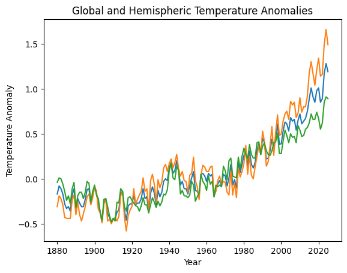
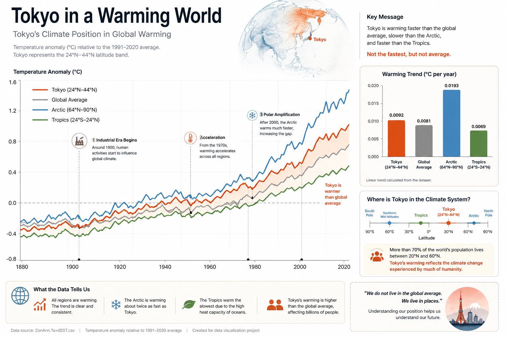
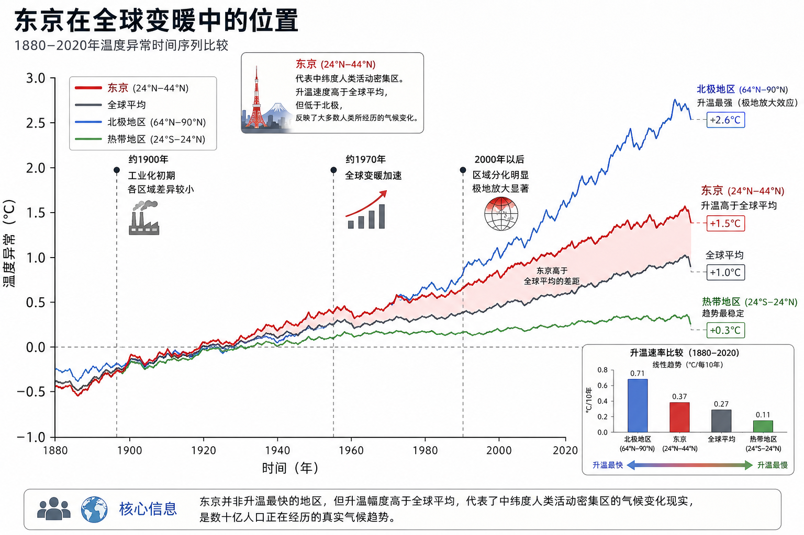
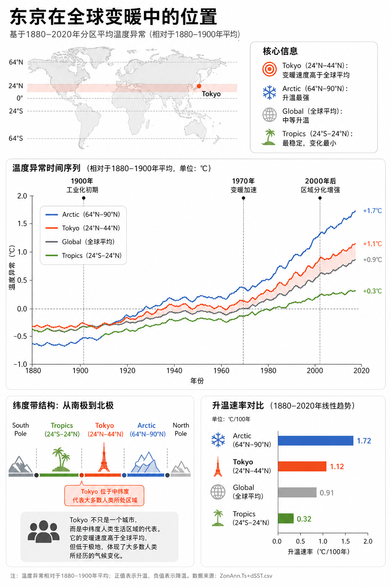

# 提示词迭代导出 PDF 成功关闭在资源管理器中显示记录表

## 基本信息

| 项目         | 内容                                     |
| ------------ | ---------------------------------------- |
| 学号         | 2312190107                               |
| 姓名         | 贺祥宇                                   |
| 使用的AI工具 | ChatGPT会话、调用GPT-image-2图像生成能力 |
| 数据文件名称 | ZonAnn.Ts+dSST.csv                       |

---

## 数据理解摘要

**数据来源**：NASA GISS Surface Temperature Analysis (GISTEMP v4)

**我选择的数据子集**：

- [x] 特定纬度带——东京地区 北纬35°41′22

**时间范围**：1880年 至 2025年

**关键发现**：

视年份时间为横轴，各分区温差数据为纵轴。

纵轴数据共有14列，全球层 + 半球层 + 三分带 + 八分带，包含了空间差异与梯度结构。

可选择特定一点为研究对象，探索其在不同研究空间上的差异。


---

## 迭代记录

### 🔄 第1轮迭代：初始尝试

**迭代目标**：

初步了解数据分布及趋势。探索进一步选择与演进方向。建立起对数据的初步理解。

**提示词**：

```
根据[ZonAnn.Ts+dSST.csv]文件数据内容。
生成一版本温度异常（Temperature Anomaly）相关数据图。
```

**生成结果**：

```
我先帮你生成了一版最核心的基线可视化：
```




**结果评价**：

| 评价维度      | 状态        | 说明 |
| ------------- | ----------- | ---- |
| 数据准确性    | ❌ | 只体现了最基础数据 |
| 图表类型合适  | ❌ | 基本折线图 |
| 标题/标签完整 | ❌ | 有 |
| 美观程度      | ❌ | 基本样式 |
| 信息传达      | ❌ | 表现了趋势 |

**问题分析**：

达到了观察数据趋势的目的。

整体上与各条分支上整体上都表现出平稳后上升的趋势。

本次提示词太过简单，指向性不明显，较差。

实际没有调用GPT的图像生成能力。调用编码能力，使用Python及pandas与plt进行数据分析与图像绘制。

内容上只有全球温差、南北半球三个标签。

最基础折线图样式，不涉及样式与美观。

**改进方向**：

需要限定在特点的研究对象。这里选择使用了「东京」——北纬35°41′22。

针对该点位，可与三分带、八分带于特定空间带进行数据分析。


---

### 🔄 第2轮迭代：发散探索

**迭代目标**：

发散思考，探索分析数据的方向与可能性。

**改进策略**：

限定了明确的研究对象。

东京：北纬35°41′22″

**提示词**：

```
根据[ZonAnn.Ts+dSST.csv]数据内容。对象东京北纬35°41′22。
1.讨论在三分带、八分带下的绝对变化趋势。
2.探讨与其他分区相比的相对趋势。
3.额外自由发散三个方向
我将会在以上5个方向选择。
本次对话处理分析数据，为后续调用图像生成能力生产可视化作品铺垫。
生成可视化作品。
```

**生成结果**：



**结果评价**：

| 评价维度      | 状态        | 说明 |
| ------------- | ----------- | ---- |
| 数据准确性    | ❌ | 数据表现混乱 |
| 图表类型合适  | ✅ | 折线图与条形图，直观明确 |
| 标题/标签完整 | ❌ | 说明详细 |
| 美观程度      | ❌ | 海报样式 |
| 信息传达      | ✅ | 表达了主题 |

**进步之处**：

锁定了研究对象。

注意到了排版、风格与样式。

**仍需改进**：

图像内容太多，主体信息不明确。

图像生成文字默认英文，需要显式指定中文字符。

**改进方向**：

需要锁定信息的主体内容。命令AI锁定该板块提示词。


---

### 🔄 第3轮迭代：主体信息锁定

**迭代目标**：

探索数据准确性与信息传达。

**提示词**：

```
根据[ZonAnn.Ts+dSST.csv]数据内容。
生成可视化作品图像，语言中文。


一张气候变化数据可视化图（climate data visualization），主题是：
Tokyo’s position in global warming（东京在全球变暖中的位置）。

图中包含四条温度异常时间序列（temperature anomaly time series, 1880–2020）：
- Tokyo（用 24N–44N 纬度带表示，主视觉，highlighted main line）
- Global average（全球平均）
- Arctic region（64N–90N，strongest warming, polar amplification）
- Tropical region（24S–24N，most stable trend）

坐标轴定义：
- 横轴：时间（years, 1880–2020）
- 纵轴：温度异常（temperature anomaly, °C）

核心关系（必须表达清楚）：
- Tokyo warming > Global average
- Tokyo warming < Arctic warming
- Tropics remain relatively stable

视觉重点：
Tokyo 曲线最突出（bold, emphasized），
Arctic 曲线上升最陡（steep increase），
Global 为中等趋势，
Tropics 最平缓。

关键时间标注（annotated milestones）：
- around 1900：工业化初期（industrial era begins），各区域差异较小
- around 1970：全球变暖加速（acceleration of global warming）
- after 2000：区域分化明显（divergence），Arctic amplification 明显，Tokyo 高于全球平均

可选增强（optional）：
- 在 Tokyo 与 Global average 之间添加半透明阴影（shaded area）表示差距
- 添加一个小型柱状图（small inset chart），展示四个区域的升温速率（slope comparison）

整体表达的信息（main message）：
Tokyo represents a mid-latitude human region,
not the fastest warming,
but warmer than the global average,
reflecting climate change experienced by much of humanity.

风格控制：
scientific infographic, clean layout, minimal design, high clarity, nature journal style


```

**生成结果**：



**结果评价**：

| 评价维度      | 状态        | 说明 |
| ------------- | ----------- | ---- |
| 数据准确性    | ✅ | 数据与折线图正确 |
| 图表类型合适  | ✅ | 合适 |
| 标题/标签完整 | ❌ | 说明不足 |
| 美观程度      | ❌ | 风格控制弱 |
| 信息传达      | ✅ | 主体信息明确 |

**进步之处**：

数据清晰、直观、准确，相比前两版对比不错。

已有数据层、叙事层。

**仍需改进**：

内容已经足够，尝试不同的风格。

可适当添加新的元素，为信息服务。

**改进方向**：

进一步探索美观与风格。


---

### 🔄 第4轮迭代：样式表现

**迭代目标**：

使用合适的样式，为信息与美观服务。

**改进策略**：

加入风格。增加视觉层提示词。

**提示词**：

```
根据[ZonAnn.Ts+dSST.csv]数据内容。生成可视化作品图像，语言中文。

一张高质量气候数据可视化海报（climate infographic poster），主题是：
Tokyo’s Position in Global Warming（东京在全球变暖中的位置）。

【整体布局（layout）】
纵向海报（vertical poster），结构分为三层：
1. 顶部（header）：标题 + 小型地理定位图
2. 中部（main）：核心时间序列数据图（占最大视觉空间）
3. 底部（supporting）：辅助解释图（纬度结构 + 趋势对比）

整体风格要求：clean, minimal, scientific infographic, well-balanced whitespace, nature journal style

---

【顶部区域（context）】
- 标题：Tokyo in a Warming World
- 副标题：A Mid-latitude Perspective on Global Climate Change
- 添加一个小型简化地图（minimal world map or East Asia map），
  标出 Tokyo 位置（small dot + label）

---

【中部核心图（main visualization）】
显示四条温度异常时间序列（temperature anomaly time series, 1880–2020）：

- Tokyo（24N–44N，主视觉，bold orange-red line）
- Global average（gray line）
- Arctic region（64N–90N，blue line，steepest increase）
- Tropical region（24S–24N，green line，stable trend）

坐标：
- X轴：years (1880–2020)
- Y轴：temperature anomaly (°C)

关键关系必须清晰表达：
- Tokyo warming > Global average
- Tokyo warming < Arctic warming
- Tropics remain relatively stable

视觉层级：
- Tokyo线最突出（thicker, high contrast）
- Arctic次之（sharp upward trend）
- Global中性
- Tropics最弱

---

【叙事标注（annotations）】
在图中标注三个关键时间点：
- around 1900：Industrial era begins（差异较小）
- around 1970：Acceleration of global warming
- after 2000：Divergence and polar amplification

添加简洁标注线和文字说明（minimal annotation style）

---

【增强表达（optional but recommended）】
- 在 Tokyo 与 Global 之间加入半透明阴影（shaded area），表示差距
- 右侧或角落添加一个小图（inset chart）：
  四个区域的升温速率对比（slope bar chart）

---

【底部辅助结构（supporting visuals）】

1. 纬度带结构图（latitude diagram）：
horizontal diagram from South Pole to North Pole，
标出：
South Pole → Tropics → Tokyo (highlighted) → Arctic → North Pole

强调 Tokyo 位于 mid-latitudes（24N–44N）

2. 人类语境提示（human context）：
小型图标或简短文字：
“Most humans live in mid-latitudes”

---

【视觉系统（visual system consistency）】

配色（color scheme）：
- Tokyo：orange-red (#E64A19)
- Arctic：cool blue (#1976D2)
- Tropics：green (#43A047)
- Global：neutral gray

风格统一：
- thin clean lines
- no sketch or hand-drawn style
- minimal flat icons
- consistent typography
- high readability

背景：
- white or very light background
- no texture, no noise

---

【核心表达（main message）】
Tokyo represents a mid-latitude human region:
not the fastest warming,
but warming faster than the global average,
reflecting the climate change experienced by much of humanity.

---

风格关键词（style keywords）：
scientific infographic, editorial design, modern data visualization, minimal, elegant, high clarity, nature journal style, balanced layout
```

**生成结果**：（粘贴截图）

.png)

.png)

**结果评价**：

| 评价维度      | 状态        | 说明 |
| ------------- | ----------- | ---- |
| 数据准确性    | ✅    | 数据正确 |
| 图表类型合适  | ✅    | 图标合适 |
| 标题/标签完整 | ✅    | 说明完整 |
| 美观程度      | ✅    | 简洁美观 |
| 信息传达      | ✅ | 信息完成 |

**进步之处**：

添加了美观的风格与图例。

**改进方向**：

进一步探索不同的视觉风格。


---

### 🔄 第5轮迭代：视觉风格换新——最终作品

**迭代目标**：

探索更加现代化的视觉风格。

**改进策略**：

修改prompt

**提示词**：

```
✅ Prompt（艺术增强版 / Visual-Enhanced Scientific Infographic）

【任务类型】
你需要生成一张“基于数据的科学可视化图像”（data-driven climate visualization）。
该图像必须兼具科学准确性 + 高级视觉设计表达（editorial-grade visual design）。

【数据约束（严格）】
必须基于《ZonAnn.Ts+dSST.csv》的真实数据结构与趋势关系进行表达：

不得虚构数据
不得改变趋势强弱关系
所有视觉强化必须服务于数据表达，而非掩盖数据

【语言要求】

所有文本使用中文
可保留必要英文术语（Tokyo, Arctic, Global, Tropics）
字体风格统一，具有现代编辑设计感（editorial typography）

【表达目标（升级）】
不仅呈现数据关系，还需实现：

科学信息的视觉叙事（data storytelling）
具有展览级别美感的可视化（gallery-quality infographic）
信息密度与视觉呼吸感的平衡（density vs whitespace control）

避免普通论文图风格，接近：
Nature + Bloomberg Graphics + 高端杂志信息设计

🎨 【整体视觉风格（关键升级）】

风格定位：

scientific × artistic hybrid
editorial infographic design
subtle data-driven aesthetics
cinematic minimalism
“冷静但有张力”的视觉表达

设计特征：

大量留白（intentional whitespace）
层级通过透明度与结构体现，而非装饰
使用“视觉流（visual flow）”引导阅读
轻微“发光/渐变”用于强调趋势（但极克制）

背景：

非纯白 → 极浅暖灰 or 冷白渐变（very subtle gradient）
无噪点、无纹理（保持高级感）
🧱 【整体布局（重新设计为更艺术化结构）】

纵向海报（vertical poster），但采用：

👉 非严格分块，而是“流式分区（flow layout）”

视觉路径：

TOP（语境）
↓
CENTER（数据主叙事，视觉重心）
↓
BOTTOM（结构解释 + 人类意义）

🌍 【顶部区域（Context / Atmospheric Design）】

标题：

主标题（更具设计感）：
Tokyo in a Warming World

副标题：
全球变暖中的中纬度视角（A Mid-latitude Climate Perspective）

设计升级：

标题采用 大字号 + 细字重对比（light vs bold typography）
轻微字距拉开（tracking）

小地图（升级）：

使用极简半透明地图轮廓（ghosted map）
Tokyo 用一个**发光点（soft glow dot）**标出
地图不是主元素，而是“背景语境提示”
📈 【核心图（Main Visualization）—艺术增强重点】

图类型不变：
→ 时间序列（1880–2020）

但视觉表达升级为：

👉 “多层叠加的时间流（layered temporal field）”

四条曲线：

Tokyo → 主视觉（橙红，带轻微发光 glow）
Arctic → 冷蓝，趋势陡峭
Global → 中性灰（细线）
Tropics → 低饱和绿色（弱存在）

🎨 关键视觉增强：

渐变线条（gradient stroke）
随时间略微增强亮度（暗 → 明）
表示 warming intensification
Tokyo 强化方式升级
更粗线
subtle outer glow
与背景形成清晰分离
Tokyo vs Global 差距表达（重要）
使用柔和半透明带（soft gradient band）
非硬边填充，而是渐隐

坐标轴（风格升级）：

极细线（hairline axis）
几乎“隐形但存在”
数值标注克制、间隔大
🧠 【叙事标注（Annotation → Editorial Style）】

关键时间点：

~1900：工业化起点
~1970：加速阶段
2000+：极地放大效应

设计方式升级：

不用传统箭头
使用：
细线连接（leader line）
小号文字块（annotation capsule）

风格类似：

👉 杂志标注 / Bloomberg 图表说明

🌡️ 【增强表达（视觉亮点）】
1️⃣ 差距表达（重点艺术化）

Tokyo vs Global：

使用柔和渐变雾状区域（mist-like shading）
体现“逐渐拉开”的关系
2️⃣ 右侧 inset（升级为设计组件）

不是简单柱状图，而是：

👉 “极简 slope 对比条”

Arctic：最高
Tokyo：中高
Global：中
Tropics：最低

风格：

无边框
细长比例
颜色呼应主图
🌎 【底部结构（Supporting Visuals）】
纬度结构（重设计）

不是普通示意图，而是：

👉 “抽象纬度带（abstract latitude bands）”

表现方式：

横向渐变带（蓝 → 绿 → 橙 → 蓝）
Tokyo 用高亮标记

标注：

South Pole → Tropics → Tokyo → Arctic → North Pole

人类语境（弱但有力）

表达：

Most humans live in mid-latitudes

设计：

极小文字
或搭配极简人形 icon（线性）
🎨 【视觉系统（高级一致性）】

配色（升级版）：

Tokyo：#E64A19（+发光）
Arctic：#1976D2（冷色渐变）
Tropics：#66BB6A（低饱和）
Global：#9E9E9E

线条：

超细（0.5–1px视觉）
Tokyo例外（更粗）

字体：

无衬线（现代）
标题：轻 + 粗组合
正文：极简
💡 【核心表达（强化版）】

Tokyo 不只是一个城市，而是：

👉 人类所处气候带的代表

它体现的是：

非最极端变化
但显著高于全球平均
是“人类真实感受到的气候变化”
🔑 【风格关键词（升级版）】

scientific infographic
editorial data design
minimal but expressive
data storytelling
cinematic clarity
nature journal aesthetic
bloomberg-style visualization
subtle glow
layered information
high-end infographic poster
```

**生成结果**：（粘贴截图）

.png)

.png)

**结果评价**：

| 评价维度      | 状态        | 说明 |
| ------------- | ----------- | ---- |
| 数据准确性    | ✅    | 准确 |
| 图表类型合适  | ✅    | 正确 |
| 标题/标签完整 | ✅    | 正确 |
| 美观程度      | ✅    | 风格和谐优美 |
| 信息传达      | ✅    | 正确 |

**最终说明**：

这一轮图像的迭代结果我很满意。

数据与内容上合理并且准确，

信息表现与传达上直观并简洁，

视觉上，选用了现代风格的海报，整体上做到了和谐美观。

可作为本次的可视化作业。


---

### 🔄 第6轮迭代：数据海报

**迭代目标**：

探索不同结构的提示词。

**提示词**：

```
【SYSTEM INSTRUCTION / 强约束层】

你正在执行一个“数据驱动的科学可视化生成任务”（data-driven scientific visualization task）。
该任务优先级高于所有风格或艺术表达。

你必须遵守以下规则：
1. 不得生成纯装饰性插画，必须是数据可视化（infographic）。
2. 不得虚构数据或改变数据趋势关系。
3. 所有视觉表达必须服务于“数据关系与科学解释”。
4. 如果信息冲突，以“数据逻辑”和“语言要求”为最高优先级。

【LANGUAGE CONSTRAINT / 语言约束】

图像中的所有文本必须使用中文（Chinese only），包括：
- 标题
- 坐标轴
- 注释
- 说明文字

允许保留极少量英文专业词（Tokyo, Global, Arctic, Tropics），但中文必须为主。

【DATA MAPPING / 数据语义绑定】

该可视化基于《ZonAnn.Ts+dSST.csv》的分区温度异常数据。

必须使用以下四个数据对象（不可替换）：
- Tokyo → 使用 24N–44N 纬度带表示
- Global → 全球平均
- Arctic → 64N–90N（升温最强）
- Tropics → 24S–24N（最稳定）

必须体现以下关系（强约束）：
- Tokyo warming > Global average
- Tokyo warming < Arctic warming
- Tropics show the least variation

【STRUCTURE / 结构编译】

生成图像必须包含三个层级结构：

1. 顶部（Context Layer）
   - 中文标题（例如：东京在全球变暖中的位置）
   - 简化地图（世界或东亚），标出 Tokyo 位置（点 + 标签）

2. 中部（Core Data Layer，视觉主体）
   - 四条温度异常时间序列（1880–2020）
   - X轴：时间（年份）
   - Y轴：温度异常（℃）
   - Tokyo 曲线为主视觉（最突出）

   必须包含：
   - 三个时间标注：
     * 1900（工业化初期）
     * 1970（变暖加速）
     * 2000年后（区域分化）

3. 底部（Supporting Layer）
   - 纬度带结构图（South Pole → Tropics → Tokyo → Arctic → North Pole）
   - Tokyo 所在位置必须被突出显示
   - 一个小型趋势对比图（slope comparison）

【VISUAL PRIORITY / 视觉优先级】

视觉层级必须如下：
1. Tokyo（最突出，暖色，粗线）
2. Arctic（强上升，冷色）
3. Global（中性）
4. Tropics（最弱）

【VISUAL SYSTEM / 视觉系统约束】

必须保持统一设计系统：
- clean, minimal, scientific infographic
- thin lines, no sketch style
- flat icons only
- consistent typography
- 高留白（balanced whitespace）

配色约束：
- Tokyo：橙红（暖色）
- Arctic：蓝色（冷色）
- Tropics：绿色
- Global：灰色

背景必须干净（白色或浅色），不得使用复杂纹理。

【OPTIONAL FEATURES / 可选增强】

如果空间允许，可以加入：
- Tokyo 与 Global 之间的半透明差值区域（shaded area）
- 小型柱状图表示升温速率（slope）

【SEMANTIC GOAL / 语义目标】

该图必须清晰表达以下含义：
东京属于中纬度人类区域，
其变暖速度高于全球平均，但低于极地，
代表了大多数人类所经历的气候变化。

【STYLE ANCHOR / 风格锚定】

scientific infographic, editorial design, modern data visualization,
minimal, elegant, high clarity, nature journal style

【EXECUTION】

现在，根据以上所有约束生成最终图像。
```

**生成结果**：（粘贴截图）




**结果评价**：

| 评价维度      | 状态        | 说明 |
| ------------- | ----------- | ---- |
| 数据准确性    | ✅    | 准确 |
| 图表类型合适  | ✅    | 合适 |
| 标题/标签完整 | ✅    | 完整 |
| 美观程度      | ✅    | 简洁直观 |
| 信息传达      | ✅    | 信息合格 |

达到了数据海报的目的。


---

## 📈 迭代历程总结

### 迭代路线图

```
第1轮 → 第2轮 → 第3轮 → 第4轮 → 第5轮
  ↓     ↓      ↓      ↓      ↓  
探索    发散    主体    样式    美化
```

### 关键转折点

**哪一轮迭代带来了最大的质量提升？**

选择了要传达主题信息后。

**是什么原因导致了这次突破？**

结构上的改进。

### 提示词技巧总结

通过本次作业，我总结出的提示词优化技巧：

1. **技巧1**：工程思维写提示词，可分为不同的层级如内容层、风格层等。
2. **技巧2**：越多不意味着越好，好的内容需要明确并清晰。
3. **技巧3**：实现的先后顺序很重要，会直接影响到结果。


---

## 💭 反思与总结

### 我学到了什么

**关于提示词工程**：结构化提示词运用。

**关于数据可视化**：数据可视化的结果与实现，体验了内容。

**关于AI工具的局限性**：若较大项目隐式推理将不可用，依靠结构。

### 如果重新做一次

我会在第一轮就：确认实现流程与提示词结构。

### 可迁移的经验

这些提示词迭代技巧可以应用到：项目工程，任何领域AI陪伴的小白实际，

---

## 附：最终作品信息

**最终可视化作品文件名**：ChatGPT Image May 1, 2026, 04_10_23 PM (1).png

**最终使用的提示词**：

```
✅ Prompt（艺术增强版 / Visual-Enhanced Scientific Infographic）

【任务类型】
你需要生成一张“基于数据的科学可视化图像”（data-driven climate visualization）。
该图像必须兼具科学准确性 + 高级视觉设计表达（editorial-grade visual design）。

【数据约束（严格）】
必须基于《ZonAnn.Ts+dSST.csv》的真实数据结构与趋势关系进行表达：

不得虚构数据
不得改变趋势强弱关系
所有视觉强化必须服务于数据表达，而非掩盖数据

【语言要求】

所有文本使用中文
可保留必要英文术语（Tokyo, Arctic, Global, Tropics）
字体风格统一，具有现代编辑设计感（editorial typography）

【表达目标（升级）】
不仅呈现数据关系，还需实现：

科学信息的视觉叙事（data storytelling）
具有展览级别美感的可视化（gallery-quality infographic）
信息密度与视觉呼吸感的平衡（density vs whitespace control）

避免普通论文图风格，接近：
Nature + Bloomberg Graphics + 高端杂志信息设计

🎨 【整体视觉风格（关键升级）】

风格定位：

scientific × artistic hybrid
editorial infographic design
subtle data-driven aesthetics
cinematic minimalism
“冷静但有张力”的视觉表达

设计特征：

大量留白（intentional whitespace）
层级通过透明度与结构体现，而非装饰
使用“视觉流（visual flow）”引导阅读
轻微“发光/渐变”用于强调趋势（但极克制）

背景：

非纯白 → 极浅暖灰 or 冷白渐变（very subtle gradient）
无噪点、无纹理（保持高级感）
🧱 【整体布局（重新设计为更艺术化结构）】

纵向海报（vertical poster），但采用：

👉 非严格分块，而是“流式分区（flow layout）”

视觉路径：

TOP（语境）
↓
CENTER（数据主叙事，视觉重心）
↓
BOTTOM（结构解释 + 人类意义）

🌍 【顶部区域（Context / Atmospheric Design）】

标题：

主标题（更具设计感）：
Tokyo in a Warming World

副标题：
全球变暖中的中纬度视角（A Mid-latitude Climate Perspective）

设计升级：

标题采用 大字号 + 细字重对比（light vs bold typography）
轻微字距拉开（tracking）

小地图（升级）：

使用极简半透明地图轮廓（ghosted map）
Tokyo 用一个**发光点（soft glow dot）**标出
地图不是主元素，而是“背景语境提示”
📈 【核心图（Main Visualization）—艺术增强重点】

图类型不变：
→ 时间序列（1880–2020）

但视觉表达升级为：

👉 “多层叠加的时间流（layered temporal field）”

四条曲线：

Tokyo → 主视觉（橙红，带轻微发光 glow）
Arctic → 冷蓝，趋势陡峭
Global → 中性灰（细线）
Tropics → 低饱和绿色（弱存在）

🎨 关键视觉增强：

渐变线条（gradient stroke）
随时间略微增强亮度（暗 → 明）
表示 warming intensification
Tokyo 强化方式升级
更粗线
subtle outer glow
与背景形成清晰分离
Tokyo vs Global 差距表达（重要）
使用柔和半透明带（soft gradient band）
非硬边填充，而是渐隐

坐标轴（风格升级）：

极细线（hairline axis）
几乎“隐形但存在”
数值标注克制、间隔大
🧠 【叙事标注（Annotation → Editorial Style）】

关键时间点：

~1900：工业化起点
~1970：加速阶段
2000+：极地放大效应

设计方式升级：

不用传统箭头
使用：
细线连接（leader line）
小号文字块（annotation capsule）

风格类似：

👉 杂志标注 / Bloomberg 图表说明

🌡️ 【增强表达（视觉亮点）】
1️⃣ 差距表达（重点艺术化）

Tokyo vs Global：

使用柔和渐变雾状区域（mist-like shading）
体现“逐渐拉开”的关系
2️⃣ 右侧 inset（升级为设计组件）

不是简单柱状图，而是：

👉 “极简 slope 对比条”

Arctic：最高
Tokyo：中高
Global：中
Tropics：最低

风格：

无边框
细长比例
颜色呼应主图
🌎 【底部结构（Supporting Visuals）】
纬度结构（重设计）

不是普通示意图，而是：

👉 “抽象纬度带（abstract latitude bands）”

表现方式：

横向渐变带（蓝 → 绿 → 橙 → 蓝）
Tokyo 用高亮标记

标注：

South Pole → Tropics → Tokyo → Arctic → North Pole

人类语境（弱但有力）

表达：

Most humans live in mid-latitudes

设计：

极小文字
或搭配极简人形 icon（线性）
🎨 【视觉系统（高级一致性）】

配色（升级版）：

Tokyo：#E64A19（+发光）
Arctic：#1976D2（冷色渐变）
Tropics：#66BB6A（低饱和）
Global：#9E9E9E

线条：

超细（0.5–1px视觉）
Tokyo例外（更粗）

字体：

无衬线（现代）
标题：轻 + 粗组合
正文：极简
💡 【核心表达（强化版）】

Tokyo 不只是一个城市，而是：

👉 人类所处气候带的代表

它体现的是：

非最极端变化
但显著高于全球平均
是“人类真实感受到的气候变化”
🔑 【风格关键词（升级版）】

scientific infographic
editorial data design
minimal but expressive
data storytelling
cinematic clarity
nature journal aesthetic
bloomberg-style visualization
subtle glow
layered information
high-end infographic poster
```

**可视化类型**：折线图

**使用的技术栈**：纯AI生成图片